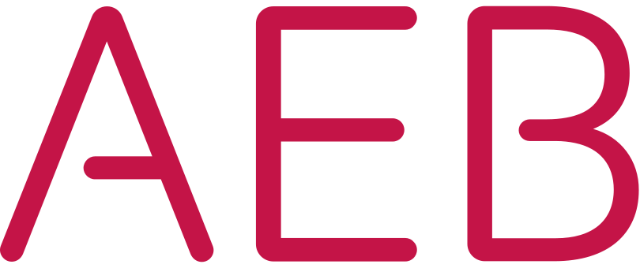

  

<h1> How to get started as developer?</h1>

This slides will give you insights on how to start your career as developer. What do we explore:

- Developing skills
- DIfferent ways of getting where you want to be

This presentation is powered by:

  

reveal.js is an open source HTML presentation framework. It enables anyone with a web browser to create beautiful presentations for free. Check out the live demo at [revealjs.com](https://revealjs.com/).

The framework comes with a powerful feature set including [nested slides](https://revealjs.com/vertical-slides/), [Markdown support](https://revealjs.com/markdown/), [Auto-Animate](https://revealjs.com/auto-animate/), [PDF export](https://revealjs.com/pdf-export/), [speaker notes](https://revealjs.com/speaker-view/), [LaTeX typesetting](https://revealjs.com/math/), [syntax highlighted code](https://revealjs.com/code/) and an [extensive API](https://revealjs.com/api/).